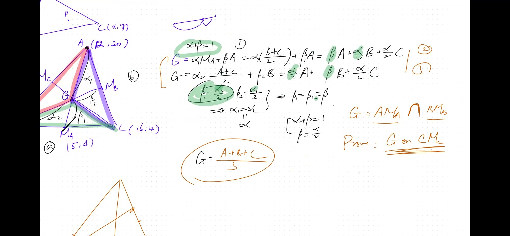
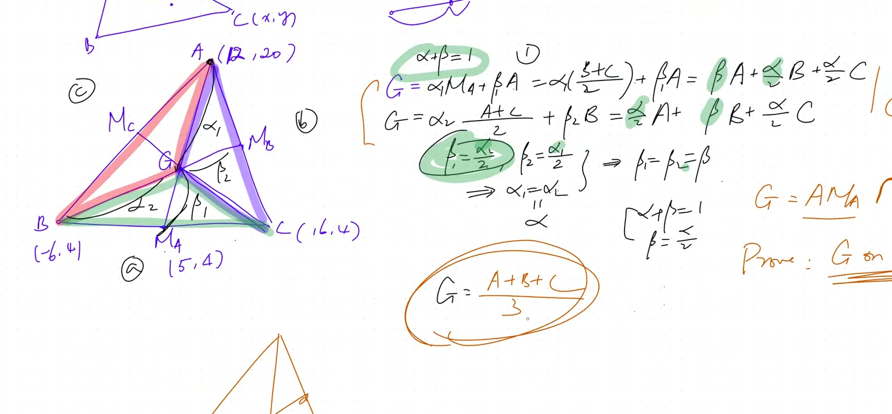
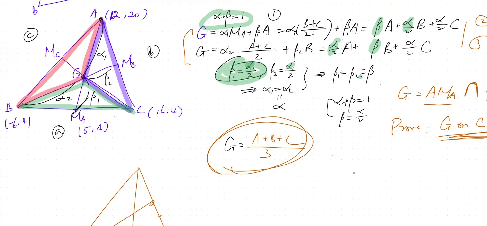
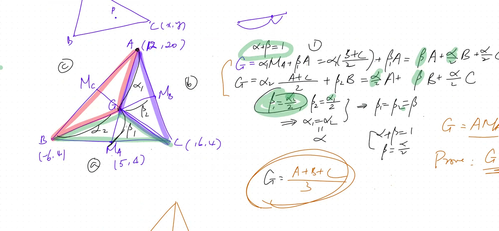

::: {.callout-tip collapse="true"}
## 现实应用：寻找平衡点

如果你用硬纸板剪出一个三角形，并试着用指尖把它托起来，恰好有一个点能让它完美平衡。这个点就是重心！

工程师用这个原理来寻找以下结构的重心：

- 飞机机翼（确保飞行稳定）
- 建筑结构（增强抗震能力）
- 机械臂（实现平衡运动）

最妙的是：无论三角形的形状多么奇特，重心总是可以用同一个简单公式来求得。
:::

## 本课内容

- 三角形的中线
- 证明三条中线共点（交于一点）
- 重心作为质心
- 利用线性组合的代数证明
- 重心将每条中线分为 2:1 的比例

::: {.callout-note collapse="true"}
## 术语：三角形的中线

**中线**是从一个顶点到对边**中点**的线段。

每个三角形恰好有3条中线（每个顶点一条）。

一个令人惊叹的事实：3条中线总是交于同一个点！这并不显而易见——三条随机的直线通常不会交于一点。
:::

## 课程视频

```{=html}
<video controls width="100%" preload="metadata">
  <source src="https://github.com/ymote/learningmath/releases/download/v1.0/2026-02-18_centroid-median-lines.mp4" type="video/mp4">
</video>
```

## 课程关键帧









## 求三角形的重心

**已知：** $A = (12, 20)$，$B = (-6, 4)$，$C = (16, 4)$

**第一步：** 求中点 $M_A$（$BC$ 的中点）：
$$M_A = \frac{1}{2}(B + C) = (5, 4)$$

**第二步：** 重心位于从顶点到对边中点 $\frac{2}{3}$ 处：

$$G = \frac{1}{3}(A + B + C) = \left(\frac{22}{3}, \frac{28}{3}\right)$$

**拖动顶点观察重心的移动：**

```{=html}
<div id="calc1" class="desmos-container"></div>
<script src="https://www.desmos.com/api/v1.9/calculator.js?apiKey=dcb31709b452b1cf9dc26972add0fda6"></script>
<script>
  var calc1 = Desmos.GraphingCalculator(document.getElementById('calc1'), {
    expressions: true,
    settingsMenu: false
  });
  // Vertices (draggable points)
  calc1.setExpression({ id: 'Ax', latex: 'a_x=12', sliderBounds: {min: -10, max: 20, step: 0.5} });
  calc1.setExpression({ id: 'Ay', latex: 'a_y=20', sliderBounds: {min: -5, max: 25, step: 0.5} });
  calc1.setExpression({ id: 'Bx', latex: 'b_x=-6', sliderBounds: {min: -15, max: 15, step: 0.5} });
  calc1.setExpression({ id: 'By', latex: 'b_y=4', sliderBounds: {min: -5, max: 25, step: 0.5} });
  calc1.setExpression({ id: 'Cx', latex: 'c_x=16', sliderBounds: {min: -10, max: 20, step: 0.5} });
  calc1.setExpression({ id: 'Cy', latex: 'c_y=4', sliderBounds: {min: -5, max: 25, step: 0.5} });

  // Triangle sides
  calc1.setExpression({ id: 'AB', latex: '((1-t)a_x+t\\cdot b_x,(1-t)a_y+t\\cdot b_y)', parametricDomain: {min: 0, max: 1}, color: '#000000' });
  calc1.setExpression({ id: 'BC', latex: '((1-t)b_x+t\\cdot c_x,(1-t)b_y+t\\cdot c_y)', parametricDomain: {min: 0, max: 1}, color: '#000000' });
  calc1.setExpression({ id: 'CA', latex: '((1-t)c_x+t\\cdot a_x,(1-t)c_y+t\\cdot a_y)', parametricDomain: {min: 0, max: 1}, color: '#000000' });

  // Midpoints
  calc1.setExpression({ id: 'MA', latex: '(\\frac{b_x+c_x}{2}, \\frac{b_y+c_y}{2})', color: '#bbbbbb', pointSize: 8 });
  calc1.setExpression({ id: 'MB', latex: '(\\frac{a_x+c_x}{2}, \\frac{a_y+c_y}{2})', color: '#bbbbbb', pointSize: 8 });
  calc1.setExpression({ id: 'MC', latex: '(\\frac{a_x+b_x}{2}, \\frac{a_y+b_y}{2})', color: '#bbbbbb', pointSize: 8 });

  // Medians (dashed)
  calc1.setExpression({ id: 'medA', latex: '((1-t)a_x+t\\frac{b_x+c_x}{2},(1-t)a_y+t\\frac{b_y+c_y}{2})', parametricDomain: {min: 0, max: 1}, color: '#c74440', lineStyle: 'DASHED' });
  calc1.setExpression({ id: 'medB', latex: '((1-t)b_x+t\\frac{a_x+c_x}{2},(1-t)b_y+t\\frac{a_y+c_y}{2})', parametricDomain: {min: 0, max: 1}, color: '#2d70b3', lineStyle: 'DASHED' });
  calc1.setExpression({ id: 'medC', latex: '((1-t)c_x+t\\frac{a_x+b_x}{2},(1-t)c_y+t\\frac{a_y+b_y}{2})', parametricDomain: {min: 0, max: 1}, color: '#388c46', lineStyle: 'DASHED' });

  // Vertices
  calc1.setExpression({ id: 'A', latex: '(a_x, a_y)', color: '#c74440', pointSize: 12, label: 'A', showLabel: true });
  calc1.setExpression({ id: 'B', latex: '(b_x, b_y)', color: '#2d70b3', pointSize: 12, label: 'B', showLabel: true });
  calc1.setExpression({ id: 'C', latex: '(c_x, c_y)', color: '#388c46', pointSize: 12, label: 'C', showLabel: true });

  // Centroid
  calc1.setExpression({ id: 'G', latex: '(\\frac{a_x+b_x+c_x}{3}, \\frac{a_y+b_y+c_y}{3})', color: '#fa7e19', pointSize: 16, label: 'Centroid G', showLabel: true });

  calc1.setMathBounds({ left: -10, right: 22, bottom: -2, top: 24 });
</script>
```

::: {.callout-tip collapse="true"}
## 证明策略

我们通过**两条不同的**中线将 $G$ 写成 $A$、$B$、$C$ 的线性组合，然后证明它们必须给出相同的结果。

**第一步：** $G$ 在从 $A$ 到 $M_A = \frac{1}{2}(B+C)$ 的中线上：
$$G = (1-\alpha) \cdot A + \frac{\alpha}{2}B + \frac{\alpha}{2}C$$

**第二步：** $G$ 也在从 $B$ 到 $M_B = \frac{1}{2}(A+C)$ 的中线上：
$$G = \frac{\alpha_2}{2}A + (1-\alpha_2)B + \frac{\alpha_2}{2}C$$

**第三步：** 比较系数——这就迫使 $\alpha = \frac{2}{3}$，所有权重都等于 $\frac{1}{3}$！
:::

## 证明：中线共点

将 $G$ 写在**两条不同的**中线上，展开为 $A, B, C$ 的表达式。比较系数可得：

$$\alpha = \frac{2}{3}, \quad \beta = \frac{1}{3}$$

这意味着 $G$ 位于从每个顶点到对边中点 $\frac{2}{3}$ 处。

### 结论：重心公式

$$\boxed{G = \frac{1}{3}(A + B + C)}$$

重心就是三个顶点的**平均值**！

## 为什么重要

- 重心是**质心**——三角形板的平衡点
- 它将每条中线分为 **2:1** 的比例（从顶点到中点）
- 这种证明方法（比较线性组合）可以推广到：
  - 更高维度
  - 三维空间中的平面方程
  - 线性建模与优化

::: {.callout-tip collapse="true"}
## 2:1 的比例

重心位于从每个顶点到对边中点 $\frac{2}{3}$ 处。

在我们的证明中，我们得到 $\alpha = \frac{2}{3}$——这就是这个比例！所以重心总是更靠近中点而不是顶点。
:::

## 速查表

::: {.key-formula}
| 概念 | 公式 |
|---|---|
| $BC$ 边的中点 | $M_A = \frac{1}{2}(B + C)$ |
| **重心** | $G = \frac{1}{3}(A + B + C)$ |
| 重心分中线 | 从顶点起 $2:1$ 的比例 |
| 中线共点 | 三条中线交于 $G$（已证明！） |

**记住：** 重心就是三个顶点坐标的平均值。把坐标加起来，除以3，搞定！
:::
