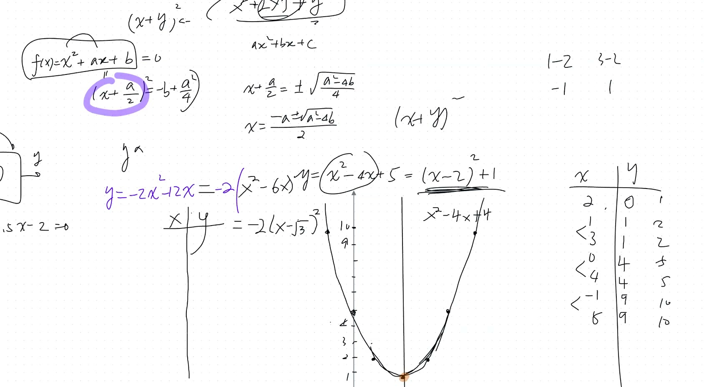
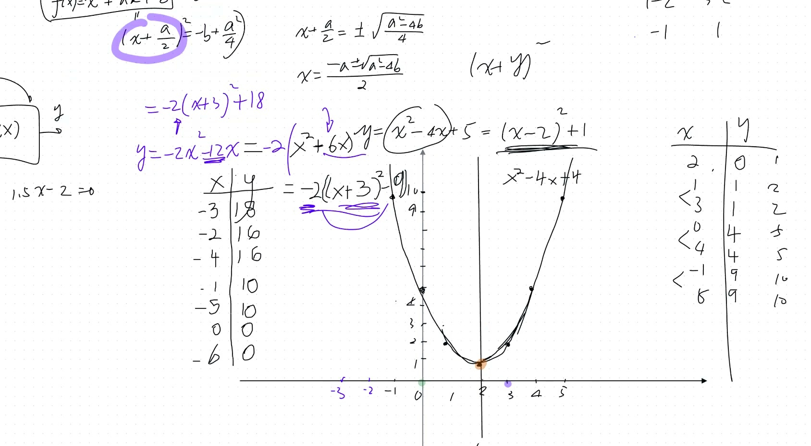
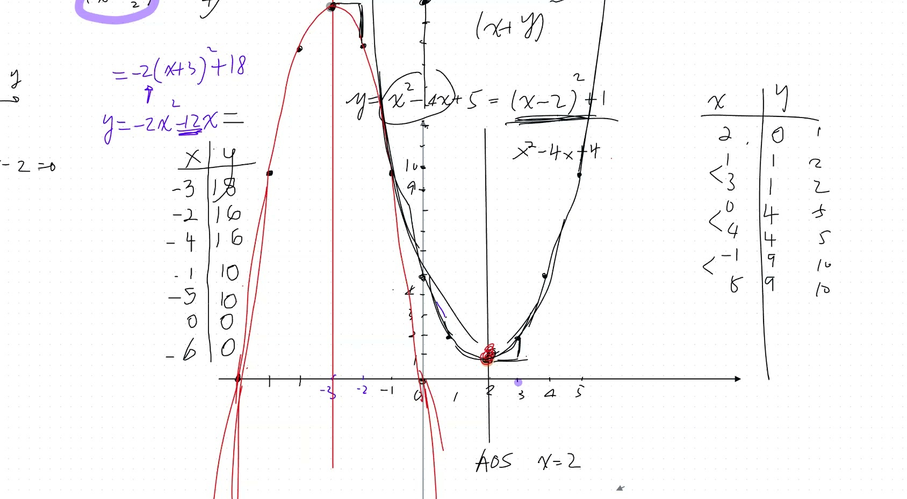
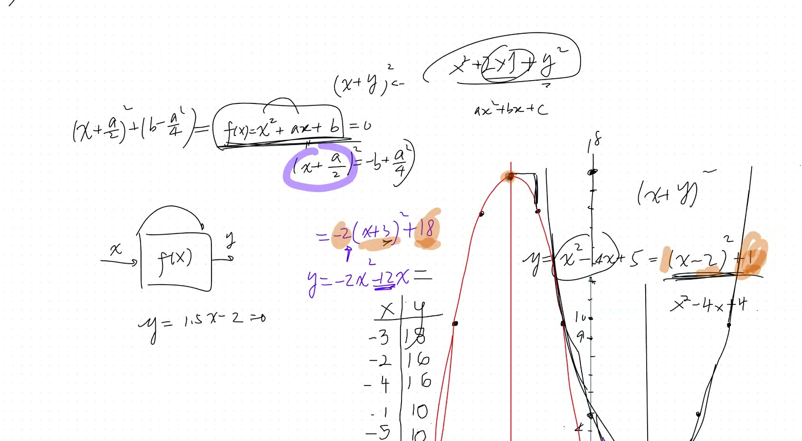

::: {.callout-tip collapse="true"}
## 为什么重要

抛物线在生活中无处不在！

- **篮球罚球**：球的飞行轨迹是一条抛物线
- **卫星天线**：抛物面形状可以聚焦信号
- **汽车前灯**：抛物面反射镜将光线聚成光束
- **桥梁**：悬索以抛物线形状悬挂

每次你向空中扔东西，它的轨迹都是一条抛物线。
:::

## 本课内容

- 配方法的过程
- 二次函数的图形
- 顶点式与对称轴 (AOS)
- 抛物线：开口向上与开口向下
- 二次函数的最大值和最小值
- 从图形构建方程

## 课程视频

```{=html}
<video controls width="100%" preload="metadata">
  <source src="https://github.com/ymote/learningmath/releases/download/v1.0/2026-01-13_completing-the-square-parabolas.mp4" type="video/mp4">
</video>
```

## 课程关键帧









## 预备知识

::: {.callout-note collapse="true"}
## 什么是二次方程？

**二次方程**是 $x$ 的最高次幂为 2 的方程。

**一般形式：** $y = ax^2 + bx + c$

举例：

- $y = x^2 + 3x + 2$ —— 二次方程（$x^2$ 是最高次幂）
- $y = 2x^2 - 5$ —— 二次方程（虽然没有 $x$ 项，但仍然有 $x^2$）
- $y = 3x + 1$ —— 不是二次方程（最高次幂是 1，这是*一次方程*）
:::

::: {.callout-note collapse="true"}
## 函数图形是什么意思？

**函数**是一种规则：你输入一个 $x$ 值，得到一个 $y$ 值。

**画图**就是：代入很多 $x$ 值，求出对应的 $y$ 值，在坐标系上画出所有点 $(x, y)$，然后用曲线连接它们。

对于 $y = x^2$：$x = -2 \Rightarrow y = 4$，$x = 0 \Rightarrow y = 0$，$x = 2 \Rightarrow y = 4$ —— 把它们连起来就得到一条 U 形曲线，叫做**抛物线**！
:::

## 核心要点

### 配方法

对于二次函数 $y = x^2 + ax + b$：

1. 关注含 $x$ 的项：$x^2 + ax$
2. 取中间系数的一半：$\left(\frac{a}{2}\right)$
3. 写成：$\left(x + \frac{a}{2}\right)^2$
4. 补偿常数项：$y = \left(x + \frac{a}{2}\right)^2 + \left(b - \frac{a^2}{4}\right)$

::: {.callout-note collapse="true"}
## 术语：抛物线、顶点、对称轴

- **抛物线**：二次函数产生的 U 形曲线。可以开口向上（碗状）或开口向下（伞状）。
- **顶点**：最高点或最低点——曲线"转弯"的地方。
- **对称轴 (AOS)**：将抛物线分成两个对称部分的竖直线。始终经过顶点。
:::

### 示例 1：$y = x^2 - 4x + 5$

::: {.callout-tip collapse="true"}
## 配方法背后的核心思想

记住 $(x - 2)^2 = x^2 - 4x + 4$

我们的方程 $x^2 - 4x + 5$ 和它*几乎一样*！它有相同的 $x^2 - 4x$ 部分，只是常数项不同。

**技巧：** 把它凑成 $(x - \text{某数})^2 + \text{剩余}$ 的形式——这样我们就能准确知道顶点在哪里！
:::

$$y = x^2 - 4x + 5 = (x - 2)^2 + 1$$

- 取 $x$ 系数的一半：$\frac{-4}{2} = -2$
- $(x-2)^2 = x^2 - 4x + 4$ 给出了前两项
- 补偿常数：$5 - 4 = 1$，所以 $y = (x-2)^2 + 1$

**试一试——拖动滑块改变 $a$、$h$、$k$：**

```{=html}
<div id="calc1" class="desmos-container"></div>
<script src="https://www.desmos.com/api/v1.9/calculator.js?apiKey=dcb31709b452b1cf9dc26972add0fda6"></script>
<script>
  var calc1 = Desmos.GraphingCalculator(document.getElementById('calc1'), {
    expressions: true,
    settingsMenu: false
  });
  calc1.setExpression({ id: 'a', latex: 'a=1', sliderBounds: {min: -3, max: 3, step: 0.1} });
  calc1.setExpression({ id: 'h', latex: 'h=2', sliderBounds: {min: -5, max: 5, step: 0.1} });
  calc1.setExpression({ id: 'k', latex: 'k=1', sliderBounds: {min: -10, max: 10, step: 0.1} });
  calc1.setExpression({ id: 'parabola', latex: 'y=a(x-h)^2+k', color: '#2d70b3' });
  calc1.setExpression({ id: 'vertex', latex: '(h, k)', color: '#c74440', pointStyle: 'POINT', pointSize: 12 });
  calc1.setExpression({ id: 'aos', latex: 'x=h', color: '#c74440', lineStyle: 'DASHED', lineWidth: 1.5 });
  calc1.setMathBounds({ left: -5, right: 9, bottom: -3, top: 15 });
</script>
```

### 示例 2：$y = -2x^2 - 12x$

$$y = -2(x+3)^2 + 18$$

- **顶点：** $(-3, 18)$ —— 这是一个**最大值**
- **对称轴：** $x = -3$
- 开口**向下**（首项系数 $< 0$）

```{=html}
<div id="calc2" class="desmos-container"></div>
<script>
  var calc2 = Desmos.GraphingCalculator(document.getElementById('calc2'), {
    expressions: true,
    settingsMenu: false
  });
  calc2.setExpression({ id: 'parabola', latex: 'y=-2(x+3)^2+18', color: '#6042a6' });
  calc2.setExpression({ id: 'vertex', latex: '(-3, 18)', color: '#c74440', pointStyle: 'POINT', pointSize: 12, label: 'Vertex (-3, 18)', showLabel: true });
  calc2.setExpression({ id: 'aos', latex: 'x=-3', color: '#c74440', lineStyle: 'DASHED' });
  calc2.setExpression({ id: 'x1', latex: '(-6, 0)', color: '#388c46', pointSize: 10, label: 'x-intercept', showLabel: true });
  calc2.setExpression({ id: 'x2', latex: '(0, 0)', color: '#388c46', pointSize: 10, label: 'x-intercept', showLabel: true });
  calc2.setMathBounds({ left: -10, right: 4, bottom: -5, top: 22 });
</script>
```

::: {.callout-tip collapse="true"}
## 为什么要从图形求方程？

在实际生活中，你经常*看到*数据（图形、测量值、轨迹），然后需要找出描述它的方程。科学家一直在做这件事：收集数据、画图、找方程。有了方程，你就可以*预测*那些还没有测量到的值。
:::

### 示例 3：从图形构建方程

**已知：** 顶点在 $(4, -1)$，经过点 $(7, -7)$

1. 由顶点得：$y = k(x - 4)^2 - 1$
2. 代入 $(7, -7)$：$-7 = k(3)^2 - 1 \Rightarrow k = -\frac{2}{3}$
3. **答案：** $y = -\frac{2}{3}(x-4)^2 - 1$

```{=html}
<div id="calc3" class="desmos-container"></div>
<script>
  var calc3 = Desmos.GraphingCalculator(document.getElementById('calc3'), {
    expressions: true,
    settingsMenu: false
  });
  calc3.setExpression({ id: 'parabola', latex: 'y=-\\frac{2}{3}(x-4)^2-1', color: '#2d70b3' });
  calc3.setExpression({ id: 'vertex', latex: '(4, -1)', color: '#c74440', pointSize: 12, label: 'Vertex (4, -1)', showLabel: true });
  calc3.setExpression({ id: 'pt', latex: '(7, -7)', color: '#388c46', pointSize: 10, label: '(7, -7)', showLabel: true });
  calc3.setExpression({ id: 'aos', latex: 'x=4', color: '#c74440', lineStyle: 'DASHED' });
  calc3.setMathBounds({ left: -2, right: 12, bottom: -12, top: 4 });
</script>
```

## 速查表

::: {.key-formula}
| 你想知道什么 | 怎么做 |
|---|---|
| 求顶点 | 配方 → $(x - h)^2 + k$ → 顶点为 $(h, k)$ |
| 求对称轴 | $x = h$（顶点的 x 坐标） |
| 开口方向？ | $a > 0$ → 向上（碗状）/ $a < 0$ → 向下（伞状） |
| 最大值还是最小值？ | 向上 → 最小值为 $y = k$ / 向下 → 最大值为 $y = k$ |
| 从图形求方程 | 顶点 → $h, k$ + 一个点 → 解出 $a$ |

### 配方法公式

$$y = x^2 + ax + b \;\longrightarrow\; y = \left(x + \frac{a}{2}\right)^2 + \left(b - \frac{a^2}{4}\right)$$
:::
