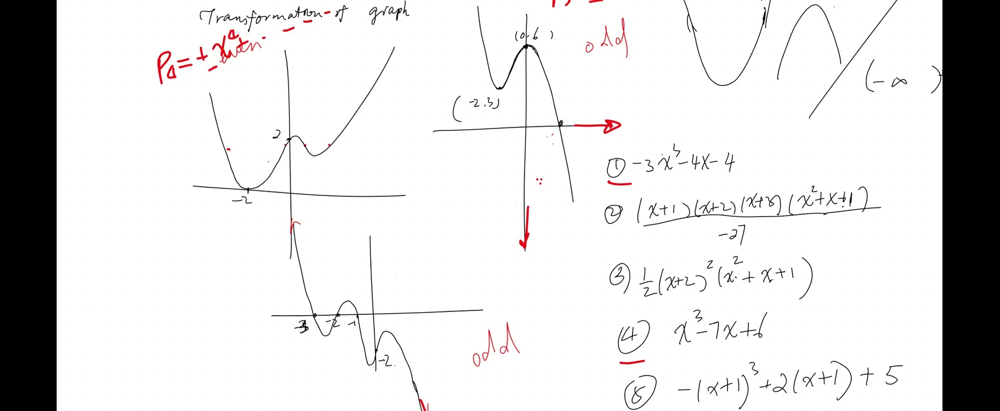
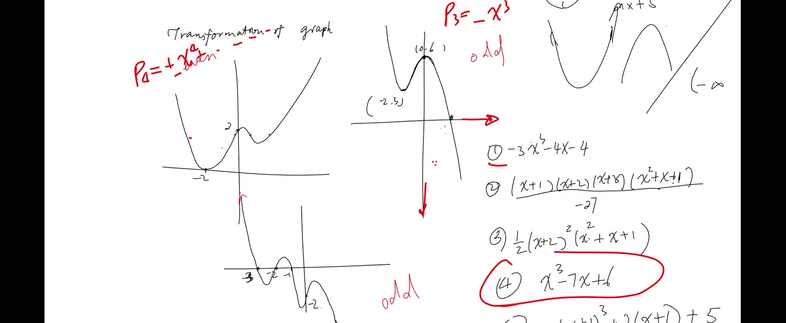
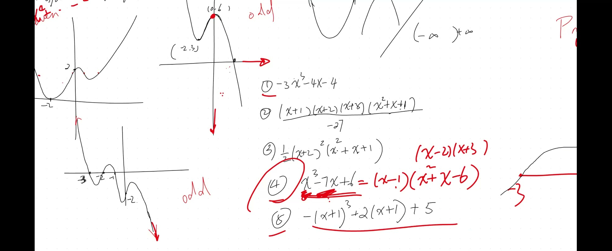

::: {.callout-tip collapse="true"}
## 现实应用：模式识别

这种将模式与模型匹配的技能——正是机器学习所做的事情！当 Netflix 推荐电影或 Spotify 推荐歌曲时，算法就是在将数据中的模式与已知模型进行匹配，就像我们将图形与方程匹配一样。
:::

## 本课内容

- 将多项式方程与其图形匹配
- 偶数次幂与奇数次幂：端点行为
- 最大转折点数 = 次数 $- 1$
- 多项式长除法
- 判别式：$\Delta = b^2 - 4ac$
- 二重根、三重根与图形行为

## 侦探工具箱

当你看到多项式图形时，按以下顺序提问：

1. **两端怎样？**（都向上？都向下？相反？）——这告诉你是偶数次还是奇数次，以及首项系数的正负号。
2. **转了几次弯？** ——这限定了次数（转折点数 $\leq$ 次数 $- 1$）。
3. **在哪里与 x 轴相交或相切？** ——这些就是根。是穿过（奇数重数）还是反弹（偶数重数）？
4. **在哪里与 y 轴相交？** ——那就是常数项（代入 $x = 0$）。

## 课程视频

```{=html}
<video controls width="100%" preload="metadata">
  <source src="https://github.com/ymote/learningmath/releases/download/v1.0/2026-02-03_polynomial-graphing-transformations.mp4" type="video/mp4">
</video>
```

## 课程关键帧








## 端点行为

| 首项 | $x \to +\infty$ | $x \to -\infty$ |
|---|---|---|
| $+x^{\text{偶数}}$ | $+\infty$ | $+\infty$ |
| $-x^{\text{偶数}}$ | $-\infty$ | $-\infty$ |
| $+x^{\text{奇数}}$ | $+\infty$ | $-\infty$ |
| $-x^{\text{奇数}}$ | $-\infty$ | $+\infty$ |

::: {.callout-tip collapse="true"}
## 快速记忆端点行为的技巧

只需看 $x \to +\infty$ 时（图形最右边）会怎样：

- 如果图形在右侧**向上** → 首项系数为正
- 如果图形在右侧**向下** → 首项系数为负

就这么简单！看一眼右侧就知道正负号。
:::

**最大转折点数** = 次数为 $n$ 的多项式最多有 $n - 1$ 个转折点

::: {.callout-note collapse="true"}
## 转折点规则

$n$ 次多项式**最多**有 $n - 1$ 个转折点。

| 次数 | 最多转折点 | 类似于... |
|---|---|---|
| 1（一次） | 0 | 直线——不转弯 |
| 2（二次） | 1 | U 形——转一次弯 |
| 3（三次） | 2 | S 形——转两次弯 |
| 4（四次） | 3 | W 形——转三次弯 |

**关键词：最多。** 三次函数*可以*有 0 个转折点（如 $y = x^3$），但绝不会超过 2 个。
:::

## 示例 1：因式分解 $x^3 - 7x + 6$

::: {.callout-note collapse="true"}
## 什么是多项式长除法？

就像普通的长除法，只是用了 $x$！

如果我们知道一个根（比如 $x = 1$），就可以除以 $(x - 1)$ 来找到剩余的因子。先匹配最高次项，相减，移下来，重复。
:::

1. 试 $x = 1$：$1 - 7 + 6 = 0$ ✓ → $(x - 1)$ 是一个因子
2. 多项式除法：$x^3 - 7x + 6 = (x - 1)(x^2 + x - 6)$
3. 分解二次式：$(x^2 + x - 6) = (x - 2)(x + 3)$
4. **结果：** $(x - 1)(x - 2)(x + 3)$，根为 $x = 1, 2, -3$

**试一试——改变根和首项系数：**

```{=html}
<div id="calc1" class="desmos-container"></div>
<script src="https://www.desmos.com/api/v1.9/calculator.js?apiKey=dcb31709b452b1cf9dc26972add0fda6"></script>
<script>
  var calc1 = Desmos.GraphingCalculator(document.getElementById('calc1'), {
    expressions: true,
    settingsMenu: false
  });
  calc1.setExpression({ id: 'r1', latex: 'a=-3', sliderBounds: {min: -5, max: 5, step: 0.1} });
  calc1.setExpression({ id: 'r2', latex: 'b=1', sliderBounds: {min: -5, max: 5, step: 0.1} });
  calc1.setExpression({ id: 'r3', latex: 'c=2', sliderBounds: {min: -5, max: 5, step: 0.1} });
  calc1.setExpression({ id: 'cubic', latex: 'y=(x-a)(x-b)(x-c)', color: '#2d70b3' });
  calc1.setExpression({ id: 'p1', latex: '(a, 0)', color: '#c74440', pointSize: 10 });
  calc1.setExpression({ id: 'p2', latex: '(b, 0)', color: '#c74440', pointSize: 10 });
  calc1.setExpression({ id: 'p3', latex: '(c, 0)', color: '#c74440', pointSize: 10 });
  calc1.setMathBounds({ left: -6, right: 6, bottom: -15, top: 15 });
</script>
```

::: {.callout-note collapse="true"}
## 术语：判别式

对于 $ax^2 + bx + c = 0$，判别式 $\Delta = b^2 - 4ac$ 告诉你二次方程有**多少个根**。可以把它想象成"现实检验"——它告诉你抛物线是否真的碰到了 x 轴，还是浮在它的上方/下方。
:::

## 判别式

对于 $ax^2 + bx + c = 0$：

$$\Delta = b^2 - 4ac$$

| $\Delta$ | 根 |
|---|---|
| $\Delta > 0$ | 两个不同的实根 |
| $\Delta = 0$ | 一个重根（二重根） |
| $\Delta < 0$ | 没有实根（复数根） |

> *"这是关于二次方程最重要的知识点！"*

::: {.callout-tip collapse="true"}
## 为什么不同的根有不同的行为？

- **单根** $(x-r)^1$：当 $x$ 经过 $r$ 时因子变号，所以图形穿过 x 轴
- **二重根** $(x-r)^2$：因子总是非负的（平方！），所以图形反弹
- **三重根** $(x-r)^3$：奇数次幂，所以穿过——但平坦的斜率形成 S 形

规则：**奇数次**穿过，**偶数次**反弹。
:::

## 根在 x 轴处的行为

- **单根** $(x - r)^1$：图形**穿过** x 轴
- **二重根** $(x - r)^2$：图形**相切**后反弹
- **三重根** $(x - r)^3$：图形以**平坦的拐点**穿过

**观察三种行为——$a$ 处单根、$b$ 处二重根、$c$ 处三重根：**

```{=html}
<div id="calc2" class="desmos-container"></div>
<script>
  var calc2 = Desmos.GraphingCalculator(document.getElementById('calc2'), {
    expressions: true,
    settingsMenu: false
  });
  calc2.setExpression({ id: 'single', latex: 'y=(x+3)', color: '#2d70b3', lineWidth: 2 });
  calc2.setExpression({ id: 'double', latex: 'y=(x-1)^2-1', color: '#c74440', lineWidth: 2 });
  calc2.setExpression({ id: 'triple', latex: 'y=0.5(x-4)^3', color: '#388c46', lineWidth: 2 });
  calc2.setExpression({ id: 'note1', latex: '(-3, 0)', color: '#2d70b3', pointSize: 10, label: 'crosses (single)', showLabel: true });
  calc2.setExpression({ id: 'note2', latex: '(1, -1)', color: '#c74440', pointSize: 10, label: 'bounces (double)', showLabel: true });
  calc2.setExpression({ id: 'note3', latex: '(4, 0)', color: '#388c46', pointSize: 10, label: 'flat crossing (triple)', showLabel: true });
  calc2.setMathBounds({ left: -6, right: 8, bottom: -5, top: 5 });
</script>
```

## 速查表

::: {.key-formula}
| 步骤 | 检查什么 |
|---|---|
| 1 | 偶数次还是奇数次？（两端同向 = 偶数，相反 = 奇数） |
| 2 | 首项系数正还是负？（右侧向上还是向下？） |
| 3 | 有多少个转折点？（最多 = 次数 - 1） |
| 4 | y 轴截距是多少？（代入 $x = 0$） |
| 5 | 能找到简单的根吗？（试 $x = 0, \pm 1, \pm 2$...） |
| 6 | 单根、二重根还是三重根？（穿过、反弹还是平坦穿过） |
:::
