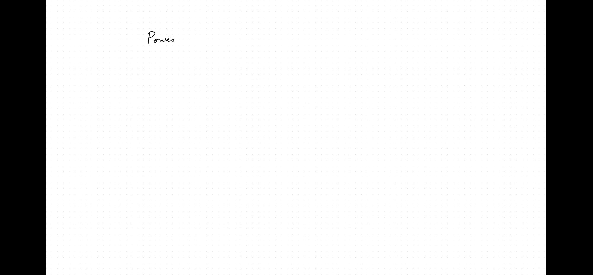
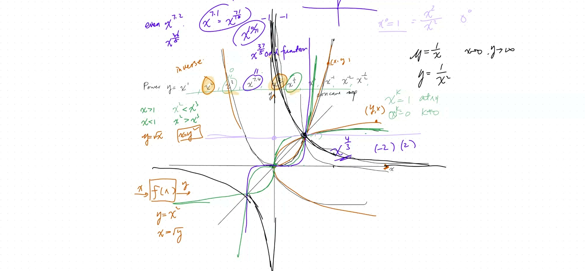
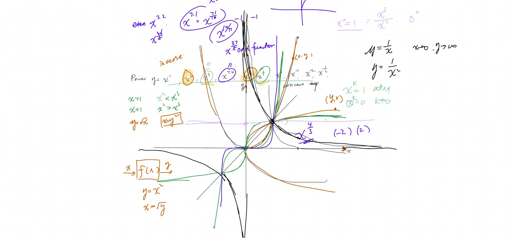
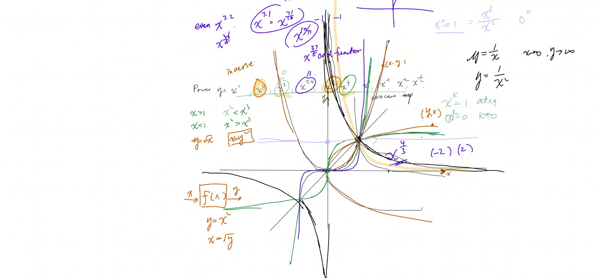

::: {.callout-tip collapse="true"}
## 现实应用：自然界中的幂

不同的幂出现在不同的物理定律中：

- $x^1$（一次）：匀速运动——距离随时间线性增长
- $x^2$（二次）：自由落体——距离随时间的*平方*增长
- $x^3$（三次）：体积——边长加倍，体积变为 $8$ 倍（$2^3$）
- $x^{1/2}$（平方根）：地震震级——能量呈指数增长
- $x^{-1}$（倒数）：声音——响度随 $\frac{1}{\text{距离}}$ 减小
- $x^{-2}$（平方反比）：引力！牛顿定律说引力随 $\frac{1}{r^2}$ 减小
:::

## 本课内容

- 各种 $k$ 值的幂函数 $y = x^k$
- 整数、分数、负数指数
- 反函数与图形对称性
- 偶函数与奇函数
- 在 $(0,0)$ 和 $(1,1)$ 处的行为

## 课程视频

```{=html}
<video controls width="100%" preload="metadata">
  <source src="https://github.com/ymote/learningmath/releases/download/v1.0/2026-02-09_power-functions-3d-coordinates.mp4" type="video/mp4">
</video>
```

## 课程关键帧









::: {.callout-note collapse="true"}
## 指数 $k$ 有什么作用？

把 $k$ 想象成一个"个性旋钮"：

- $k = 1$：平淡的直线
- $k > 1$：曲线向上弯曲（比线性增长更快）
- $0 < k < 1$：曲线向下弯曲（比线性增长更慢，像开根号）
- $k = 0$：$y = 1$ 的水平线（任何数的零次幂都是 1）
- $k < 0$：曲线在零附近趋向无穷大，在远处趋向零

**神奇的点：** 所有幂函数都经过 $(1, 1)$，因为对任何 $k$，$1^k = 1$！
:::

## 幂函数族

所有幂函数 $y = x^k$ 都经过 $(1, 1)$，且（当 $k \neq 0$ 时）经过 $(0, 0)$。

- 当 $x > 1$ 时：幂次越高 → 值越大（曲线越陡）
- 当 $0 < x < 1$ 时：幂次越高 → 值越小（越靠近 x 轴）

**试一试——改变指数 $k$：**

```{=html}
<div id="calc1" class="desmos-container"></div>
<script src="https://www.desmos.com/api/v1.9/calculator.js?apiKey=dcb31709b452b1cf9dc26972add0fda6"></script>
<script>
  var calc1 = Desmos.GraphingCalculator(document.getElementById('calc1'), {
    expressions: true,
    settingsMenu: false
  });
  calc1.setExpression({ id: 'k', latex: 'k=2', sliderBounds: {min: -3, max: 7, step: 0.1} });
  calc1.setExpression({ id: 'power', latex: 'y=x^k', color: '#2d70b3' });
  calc1.setExpression({ id: 'ref', latex: 'y=x', color: '#bbbbbb', lineStyle: 'DASHED' });
  calc1.setExpression({ id: 'p1', latex: '(1, 1)', color: '#c74440', pointSize: 10, label: '(1,1)', showLabel: true });
  calc1.setMathBounds({ left: -3, right: 5, bottom: -3, top: 8 });
</script>
```

::: {.callout-tip collapse="true"}
## 偶函数/奇函数的快速判断

代入 $-x$ 看看会怎样：

- **偶函数：** $f(-x) = f(x)$ → 关于 y 轴对称（左右镜像）。例如：$x^2$、$x^4$
- **奇函数：** $f(-x) = -f(x)$ → 关于原点对称（旋转 180 度）。例如：$x$、$x^3$、$1/x$
:::

## 分数指数的奇偶性

对于 $y = x^{p/q}$（最简分数）：

| 分子 $p$ | 分母 $q$ | 函数类型 | 定义域 |
|---|---|---|---|
| 奇数 | 奇数 | **奇**函数 | 全体实数 |
| 偶数 | 奇数 | **偶**函数 | 全体实数 |
| 任意 | 偶数 | **非奇非偶** | 仅 $x \geq 0$ |

**举例：** $x^{7.4} = x^{37/5}$ —— 37 和 5 都是奇数 → **奇函数**

**举例：** $x^{7.2} = x^{36/5}$ —— 36 是偶数 → **偶函数**

::: {.callout-note collapse="true"}
## 术语：反函数

如果函数 $f$ 把输入 $x$ 变成输出 $y$，那么反函数 $f^{-1}$ 就把 $y$ 变回 $x$。

**举例：**
- $f(x) = x^2$ 对一个数求平方：$f(3) = 9$
- $f^{-1}(x) = \sqrt{x}$ 对它开方：$f^{-1}(9) = 3$

**从图形上看：** 反函数是关于直线 $y = x$ 的**镜像**。

可以这样理解：如果 $(3, 9)$ 在 $y = x^2$ 上，那么 $(9, 3)$ 就在 $y = \sqrt{x}$ 上——坐标只是交换了！
:::

## 反函数

- $x^2$ 和 $\sqrt{x}$ 互为反函数
- $x^3$ 和 $\sqrt[3]{x}$ 互为反函数
- 图形上：关于 $y = x$ 的**镜像**
- 在方程中交换 $x$ 和 $y$ 就得到反函数

**观察镜像对称——$x^2$ 与 $\sqrt{x}$：**

```{=html}
<div id="calc2" class="desmos-container"></div>
<script>
  var calc2 = Desmos.GraphingCalculator(document.getElementById('calc2'), {
    expressions: true,
    settingsMenu: false
  });
  calc2.setExpression({ id: 'n', latex: 'n=2', sliderBounds: {min: 1, max: 5, step: 1} });
  calc2.setExpression({ id: 'f', latex: 'y=x^n', color: '#2d70b3', domain: {min: 0, max: 10} });
  calc2.setExpression({ id: 'finv', latex: 'y=x^{\\frac{1}{n}}', color: '#c74440', domain: {min: 0, max: 10} });
  calc2.setExpression({ id: 'mirror', latex: 'y=x', color: '#bbbbbb', lineStyle: 'DASHED' });
  calc2.setExpression({ id: 'p1', latex: '(1, 1)', color: '#000000', pointSize: 8 });
  calc2.setMathBounds({ left: -1, right: 5, bottom: -1, top: 5 });
</script>
```

## 速查表

::: {.key-formula}
| 指数 $k$ | 名称 | 形状 | 关键特征 |
|---|---|---|---|
| $k > 1$ | 幂函数 | 急剧上升的曲线 | 比线性增长更快 |
| $0 < k < 1$ | 根函数 | 弯曲后变平 | 比线性增长更慢 |
| $k = 0$ | 常函数 | $y = 1$ 的水平线 | $x^0 = 1$ 恒成立 |
| $k < 0$ | 倒数函数 | 沿坐标轴有渐近线 | 在 $x = 0$ 处趋向无穷 |

**万能点：** 所有 $y = x^k$ 都经过 $(1, 1)$

| 概念 | 结论 |
|---|---|
| $x^0 = 1$ | 对所有 $x \neq 0$ 成立 |
| $x^{-n} = \frac{1}{x^n}$ | 负指数 = 倒数 |
| $x^{p/q} = \sqrt[q]{x^p}$ | 分数指数 = 根号 |
| 反函数：交换 $x \leftrightarrow y$ | 关于 $y = x$ 的镜像 |
:::
