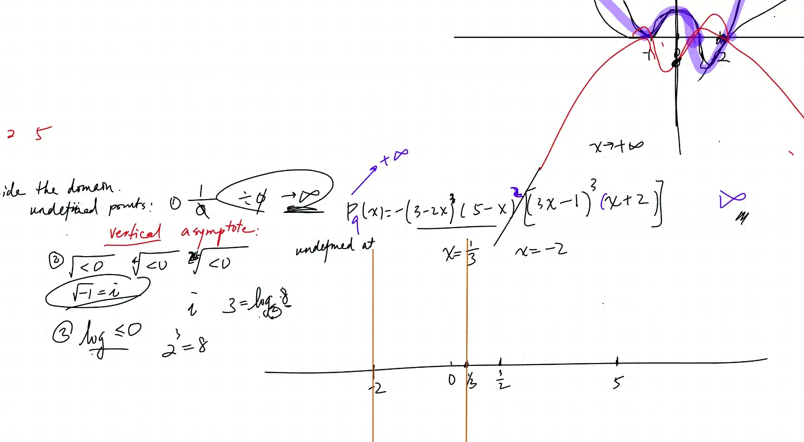
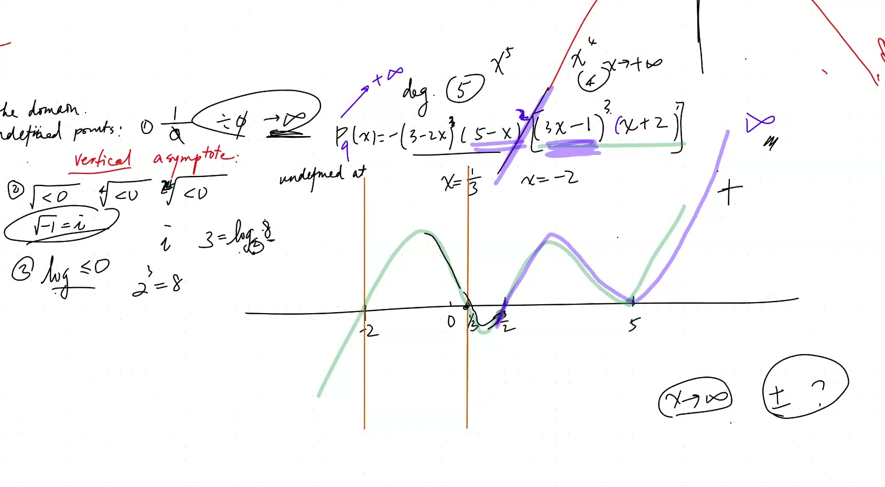
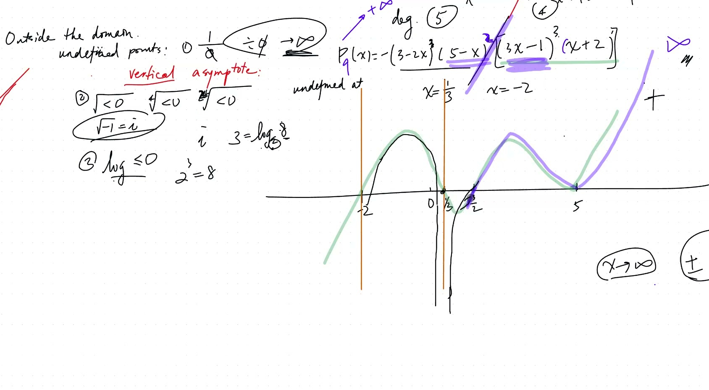
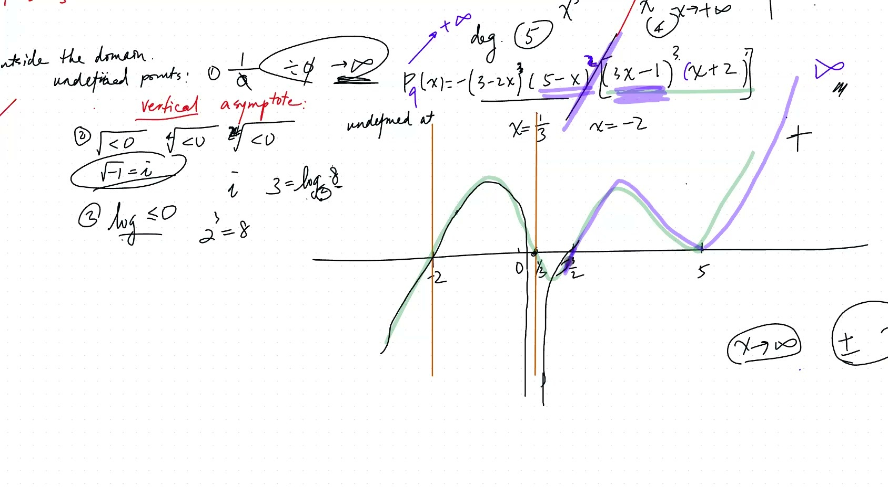

::: {.callout-tip collapse="true"}
## 现实应用：渐近线无处不在

渐近线在生活中随处可见：

- **光速**：当你给粒子加速时，它的速度趋近但永远达不到光速
- **医学**：血液中的药物浓度快速升高，然后渐近地趋近一个最大值
- **经济学**：边际递减效应——第 100 个员工带来的效益远不如第 1 个
- **手机电池**：接近 100% 时充电速度变慢
:::

## 本课内容

- 首项系数与多项式的端点行为
- 有理函数：$R(x) = \frac{P(x)}{Q(x)}$
- 垂直渐近线（除以零）
- 水平渐近线（次数比较）
- 三类未定义运算
- 有理函数的图形

## 课程视频

```{=html}
<video controls width="100%" preload="metadata">
  <source src="https://github.com/ymote/learningmath/releases/download/v1.0/2026-01-27_rational-functions-asymptotes.mp4" type="video/mp4">
</video>
```

## 课程关键帧









::: {.callout-note collapse="true"}
## 什么是有理函数？

你已经知道多项式了，比如 $y = x^2 - 3x + 2$。

**有理函数**就是一个多项式除以另一个多项式：

$$R(x) = \frac{\text{分子多项式}}{\text{分母多项式}} = \frac{P(x)}{Q(x)}$$

关键区别：分母可以等于**零**，这使得函数在那些点**无定义**！
:::

::: {.callout-note collapse="true"}
## 术语：渐近线

图形越来越接近但**永远不会真正碰到**的一条线。

想象你走向一面墙，但每一步只走剩余距离的一半。你越来越近但从技术上说永远到不了。那面墙就是你的渐近线！

- **垂直渐近线**：图形趋近的竖直线（函数值趋向无穷大）
- **水平渐近线**：当 $x \to \pm\infty$ 时图形趋近的水平线
:::

## 三类未定义运算

1. **除以零** → 垂直渐近线（函数 → ∞）
2. **负数的偶数次根** → 限制定义域
3. **非正数的对数** → 限制定义域

> 判别式 $b^2 - 4ac < 0$ 意味着二次方程没有实数根。

## 示例 1：画 $y = \frac{1}{x}$ 的图形

- 垂直渐近线：$x = 0$
- 水平渐近线：$y = 0$
- 奇函数：$f(-x) = -f(x)$（关于原点对称）

**试一试——用滑块移动渐近线：**

```{=html}
<div id="calc1" class="desmos-container"></div>
<script src="https://www.desmos.com/api/v1.9/calculator.js?apiKey=dcb31709b452b1cf9dc26972add0fda6"></script>
<script>
  var calc1 = Desmos.GraphingCalculator(document.getElementById('calc1'), {
    expressions: true,
    settingsMenu: false
  });
  calc1.setExpression({ id: 'a', latex: 'a=1', sliderBounds: {min: -5, max: 5, step: 0.1} });
  calc1.setExpression({ id: 'h', latex: 'h=0', sliderBounds: {min: -5, max: 5, step: 0.1} });
  calc1.setExpression({ id: 'k', latex: 'k=0', sliderBounds: {min: -5, max: 5, step: 0.1} });
  calc1.setExpression({ id: 'func', latex: 'y=\\frac{a}{x-h}+k', color: '#2d70b3' });
  calc1.setExpression({ id: 'va', latex: 'x=h', color: '#fa7e19', lineStyle: 'DASHED', lineWidth: 1.5 });
  calc1.setExpression({ id: 'ha', latex: 'y=k', color: '#c74440', lineStyle: 'DASHED', lineWidth: 1.5 });
  calc1.setMathBounds({ left: -10, right: 10, bottom: -10, top: 10 });
</script>
```

::: {.callout-tip collapse="true"}
## 次数比较法（为什么有效）

当 $x$ 非常大时，只有最高次幂起作用。其他的都微不足道！

例如：$\frac{3x^5 + 2x}{x^3 - 1}$ —— 当 $x$ 很大时，基本等于 $\frac{3x^5}{x^3} = 3x^2 \to \infty$（头重型）
:::

## 渐近行为

对于 $R(x) = \frac{P(x)}{Q(x)}$，比较次数：

| 条件 | 当 $x \to \pm\infty$ | 名称 |
|---|---|---|
| $\deg(P) > \deg(Q)$ | $R(x) \to \pm\infty$ | **头重型** |
| $\deg(P) < \deg(Q)$ | $R(x) \to 0$ | **脚重型** |
| $\deg(P) = \deg(Q)$ | $R(x) \to \frac{a_n}{b_n}$ | 水平渐近线 |

### 无穷远处的正负号

数负因子的个数（包括首项系数）。偶数/奇数次根不影响正负号分析——只需数负号的个数！

::: {.callout-note collapse="true"}
## 预告：虚数

"不能对负数开偶数次根"这个规则其实可以打破！在高等数学中，我们定义 $i = \sqrt{-1}$（"虚数单位"）。于是 $\sqrt{-4} = 2i$。

尽管名字叫"虚数"，这些数在实际工程中被广泛使用——电路、量子物理和信号处理。
:::

## 垂直渐近线附近的行为

在由分母中因子 $(x - r)^n$ 产生的垂直渐近线 $x = r$ 处：

- **奇数次幂 $n$**：函数变号（一侧趋向 $+\infty$，另一侧趋向 $-\infty$）
- **偶数次幂 $n$**：函数不变号（两侧都趋向 $\pm\infty$ 的同一方向）

**探索具有多条渐近线的有理函数：**

```{=html}
<div id="calc2" class="desmos-container"></div>
<script>
  var calc2 = Desmos.GraphingCalculator(document.getElementById('calc2'), {
    expressions: true,
    settingsMenu: false
  });
  calc2.setExpression({ id: 'func', latex: 'y=\\frac{(x-2)}{(x+1)(x-3)}', color: '#6042a6' });
  calc2.setExpression({ id: 'va1', latex: 'x=-1', color: '#fa7e19', lineStyle: 'DASHED' });
  calc2.setExpression({ id: 'va2', latex: 'x=3', color: '#fa7e19', lineStyle: 'DASHED' });
  calc2.setExpression({ id: 'ha', latex: 'y=0', color: '#c74440', lineStyle: 'DASHED' });
  calc2.setExpression({ id: 'zero', latex: '(2, 0)', color: '#388c46', pointSize: 10, label: 'zero', showLabel: true });
  calc2.setMathBounds({ left: -6, right: 8, bottom: -10, top: 10 });
</script>
```

## 速查表

::: {.key-formula}
| 问题 | 答案 |
|---|---|
| 垂直渐近线在哪里？ | 令分母 = 0，解出 $x$ |
| 渐近线附近函数趋向 $+\infty$ 还是 $-\infty$？ | 检查两侧的正负号 |
| 当 $x \to \pm\infty$ 时会怎样？ | 比较次数（头重型/脚重型） |
| 奇数次根 | 函数变号（穿过） |
| 偶数次根 | 函数反弹（两侧同号） |

### 三件绝对不能做的事

1. **除以零** → 垂直渐近线
2. **负数的偶数次根** → 限制定义域
3. **非正数的对数** → 限制定义域
:::
