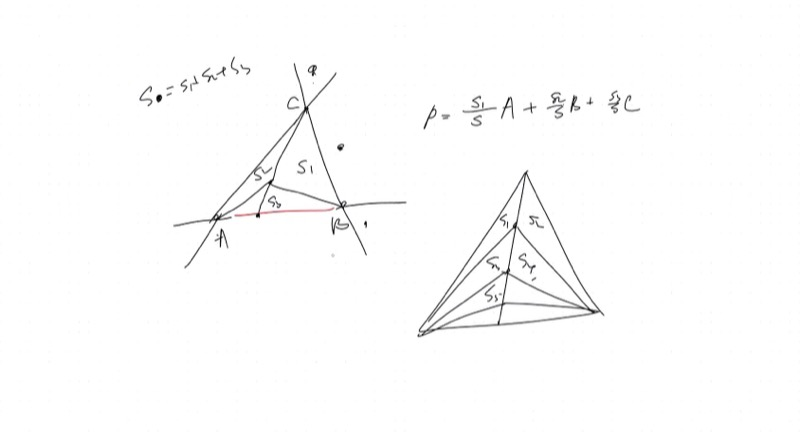
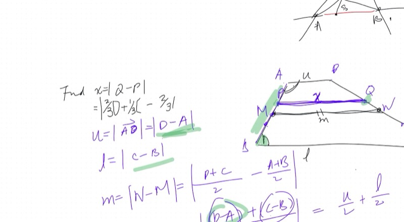
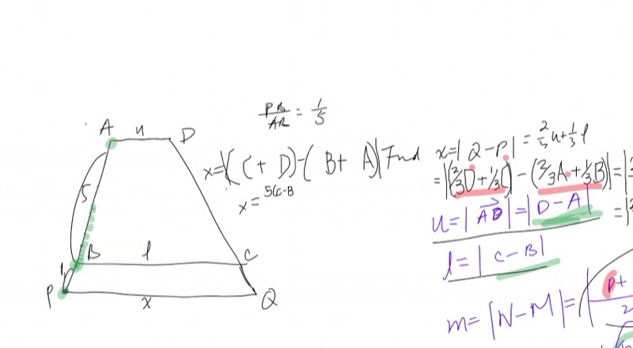
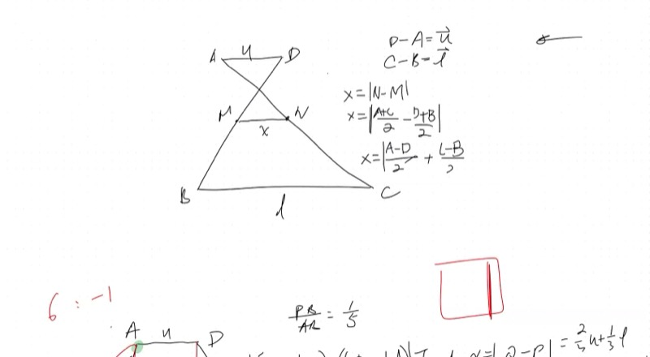

::: {.callout-tip collapse="true"}
## 有符号坐标为什么重要

当GPS定位你的位置时，它不关心你是在某个区域的"内部"还是"外部"——数学运算方式完全相同。有符号坐标让数学家仅用三个参考顶点就能描述平面上的**任意**点，即使该点在三角形外部。同样的思想驱动着计算机图形学、机器人技术和物理模拟。
:::

## 本课内容

- 回顾：内部点的重心坐标——$P = \frac{S_1}{S}A + \frac{S_2}{S}B + \frac{S_3}{S}C$
- 蝴蝶三角形面积比：相等的比例在子三角形中传递
- 梯形中位线：用向量方法证明 $m = \frac{u + \ell}{2}$
- 推广到任意三等分线：$x = \frac{2}{3}u + \frac{1}{3}\ell$
- 加权平均应用于线段长度（不仅仅是坐标）
- 负权重：当点位于线段外部时会发生什么
- 外部点的有符号重心坐标

## 课程视频

```{=html}
<video controls width="100%" preload="metadata">
  <source src="https://github.com/ymote/learningmath/releases/download/v1.0/2026-02-23_trapezoid-midsegments-signed-coordinates.mp4" type="video/mp4">
</video>
```

## 课程关键帧









## 预备知识

::: {.callout-note collapse="true"}
## 什么是重心坐标？

给定三角形 $ABC$ 和其内部的点 $P$，将 $P$ 与三个顶点相连。这会把三角形分成三个面积分别为 $S_1$、$S_2$、$S_3$ 的小三角形（分别对应顶点 $A$、$B$、$C$ 的对面）。

点 $P$ 可以写成顶点的**加权平均**：

$$P = \frac{S_1}{S}A + \frac{S_2}{S}B + \frac{S_3}{S}C$$

其中 $S = S_1 + S_2 + S_3$ 是总面积。权重之和始终等于1。
:::

::: {.callout-note collapse="true"}
## 什么是梯形？

**梯形**是恰好有一对平行边的四边形。平行的两条边称为**底边**（上底 $u$ 和下底 $\ell$），它们之间的垂直距离是**高** $h$。

**面积** $= \frac{1}{2}(u + \ell) \cdot h$

**中位线**（中线段）连接两条非平行边的中点。
:::

## 核心要点

### 用向量推导梯形中位线

将梯形的顶点标记为 $A$、$B$、$C$、$D$，其中 $AD$ 是上底（长度 $u$），$BC$ 是下底（长度 $\ell$）。

两条非平行边的中点分别为：
$$M = \frac{A + B}{2}, \quad N = \frac{D + C}{2}$$

中位线的长度为：
$$|N - M| = \left|\frac{D + C}{2} - \frac{A + B}{2}\right| = \frac{1}{2}|(\underbrace{D - A}_{= u}) + (\underbrace{C - B}_{= \ell})| = \frac{u + \ell}{2}$$

::: {.callout-tip collapse="true"}
## 为什么向量让这一切如此简洁

无需画辅助线（翻转梯形、构造平行四边形），我们把每个点表示为向量，然后用代数运算。关键洞见：$D - A$ 和 $C - B$ 指向**同一方向**（都是水平的），所以它们的模直接相加。
:::

**探索——拖动顶点来改变梯形的形状：**

```{=html}
<div id="calc1" class="desmos-container"></div>
<script src="https://www.desmos.com/api/v1.9/calculator.js?apiKey=dcb31709b452b1cf9dc26972add0fda6"></script>
<script>
  var calc1 = Desmos.GraphingCalculator(document.getElementById('calc1'), {
    expressions: true,
    settingsMenu: false
  });
  calc1.setExpression({ id: 'A', latex: 'A=(1,4)', color: '#2d70b3', pointSize: 10, label: 'A', showLabel: true });
  calc1.setExpression({ id: 'B', latex: 'B=(0,0)', color: '#2d70b3', pointSize: 10, label: 'B', showLabel: true });
  calc1.setExpression({ id: 'C', latex: 'C=(8,0)', color: '#2d70b3', pointSize: 10, label: 'C', showLabel: true });
  calc1.setExpression({ id: 'D', latex: 'D=(5,4)', color: '#2d70b3', pointSize: 10, label: 'D', showLabel: true });
  calc1.setExpression({ id: 'trap', latex: 'polygon(A,B,C,D)', color: '#2d70b3', fillOpacity: 0.1 });
  calc1.setExpression({ id: 'M', latex: 'M=\\frac{A+B}{2}', color: '#c74440', pointSize: 8, label: 'M (midpoint)', showLabel: true });
  calc1.setExpression({ id: 'N', latex: 'N=\\frac{D+C}{2}', color: '#c74440', pointSize: 8, label: 'N (midpoint)', showLabel: true });
  calc1.setExpression({ id: 'med', latex: 'segment(M,N)', color: '#c74440', lineWidth: 3 });
  calc1.setMathBounds({ left: -2, right: 10, bottom: -2, top: 7 });
</script>
```

### 推广：三等分线

如果我们取的不是中点，而是从顶部算起 $\frac{1}{3}$ 处的点：

$$P = \frac{2}{3}A + \frac{1}{3}B, \quad Q = \frac{2}{3}D + \frac{1}{3}C$$

那么：

$$x = |Q - P| = \frac{2}{3}u + \frac{1}{3}\ell$$

底边的加权平均给出**任意高度**处的长度——只需改变权重即可！

### 负权重：线段外部的点

当点 $P$ 位于线段 $AB$ 的**外部**时，我们仍然可以将它写成加权平均——但其中一个权重变为**负数**。

::: {.callout-important}
## 核心要点：有符号权重

如果 $P$ 在线段 $AB$ 外部，比例为 $AP:PB = 6:(-1)$，则：

$$P = \frac{-1}{5}A + \frac{6}{5}B$$

权重**仍然必须加起来等于1**：$\frac{-1}{5} + \frac{6}{5} = 1$。

负权重意味着你已经**越过了**端点——该点在某个顶点的"另一侧"。
:::

```{=html}
<div id="calc2" class="desmos-container"></div>
<script>
  var calc2 = Desmos.GraphingCalculator(document.getElementById('calc2'), {
    expressions: true,
    settingsMenu: false
  });
  calc2.setExpression({ id: 't', latex: 't=0.5', sliderBounds: {min: -0.5, max: 1.5, step: 0.01} });
  calc2.setExpression({ id: 'A', latex: 'A=(1,2)', color: '#2d70b3', pointSize: 10, label: 'A', showLabel: true });
  calc2.setExpression({ id: 'B', latex: 'B=(7,2)', color: '#2d70b3', pointSize: 10, label: 'B', showLabel: true });
  calc2.setExpression({ id: 'seg', latex: 'segment(A,B)', color: '#2d70b3', lineWidth: 2 });
  calc2.setExpression({ id: 'P', latex: 'P=(1-t)A+tB', color: '#c74440', pointSize: 12, label: 'P = (1-t)A + tB', showLabel: true });
  calc2.setExpression({ id: 'wA', latex: '(1,4)', color: '#388c46', label: 'weight on A = 1-t', showLabel: true, pointSize: 0 });
  calc2.setExpression({ id: 'wB', latex: '(7,4)', color: '#6042a6', label: 'weight on B = t', showLabel: true, pointSize: 0 });
  calc2.setMathBounds({ left: -2, right: 10, bottom: -1, top: 6 });
</script>
```

### 有符号重心坐标

对于三角形 $ABC$ **外部**的点 $P$，相同的公式仍然成立：

$$P = \frac{S_1}{S}A + \frac{S_2}{S}B + \frac{S_3}{S}C$$

当 $P$ 位于第 $i$ 条边与三角形内部相反的一侧时，面积 $S_i$ 为**负数**。有符号面积的总和 $S = S_1 + S_2 + S_3$ 仍然等于三角形的面积。

## 速查表

::: {.key-formula}
| 你想求什么 | 怎么做 |
|---|---|
| 梯形的中位线 | $m = \frac{u + \ell}{2}$ |
| 从顶部算起比例 $t$ 处的线段 | $x = (1-t) \cdot u + t \cdot \ell$ |
| 线段外部的点 | 使用负权重；权重之和仍为1 |
| 外部重心坐标 | 公式相同；"远"顶点对面的面积为负 |
| 蝴蝶比例 | 所有共享角平分线的子三角形对遵循相同的比例 |

### 线段长度的向量方法

$$|Q - P| = |(1-t)(D-A) + t(C-B)| = (1-t) \cdot u + t \cdot \ell$$

（成立的原因是两个向量指向同一方向）
:::
