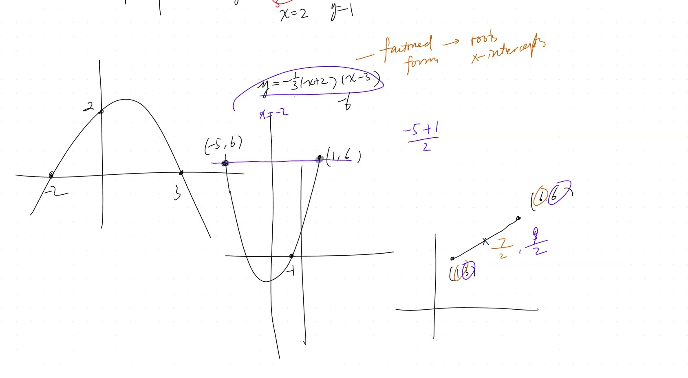
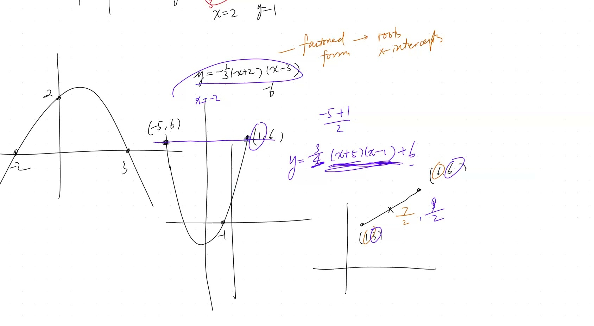
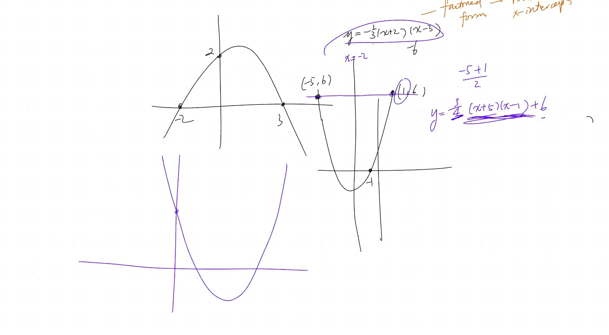
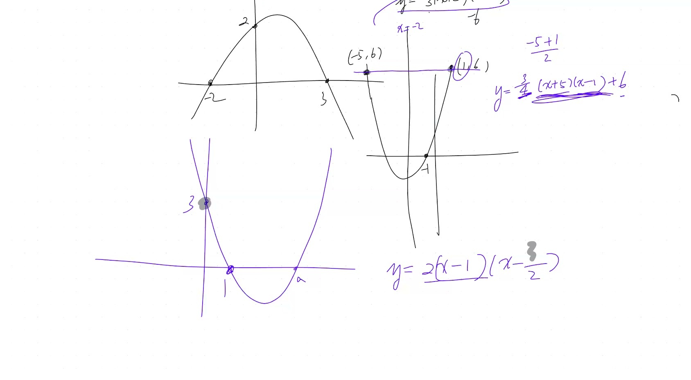

## Topics Covered

- Constructing quadratic equations from graphs
- Factored form vs completed square form
- Using x-intercepts, y-intercepts, and symmetry
- Extension to cubic polynomials
- Signs of coefficients $a$, $b$, $c$

## Key Video Frames









## Two Major Forms

| Form | Expression | Best when you know... |
|---|---|---|
| **Factored form** | $y = k(x - r_1)(x - r_2)$ | The roots/x-intercepts |
| **Completed square** | $y = a(x - h)^2 + k$ | The vertex/AOS |

## Example 1: Find equation from two x-intercepts

**Given:** x-intercepts at $-2$ and $3$, y-intercept at $2$

1. From roots: $y = k(x + 2)(x - 3)$
2. Plug in $(0, 2)$: $2 = k(2)(-3) = -6k \Rightarrow k = -\frac{1}{3}$
3. **Answer:** $y = -\frac{1}{3}(x + 2)(x - 3)$

**Try it — drag the roots and see how the parabola changes:**

```{=html}
<div id="calc1" class="desmos-container"></div>
<script src="https://www.desmos.com/api/v1.9/calculator.js?apiKey=dcb31709b452b1cf9dc26972add0fda6"></script>
<script>
  var calc1 = Desmos.GraphingCalculator(document.getElementById('calc1'), {
    expressions: true,
    settingsMenu: false
  });
  calc1.setExpression({ id: 'r1', latex: 'r_1=-2', sliderBounds: {min: -5, max: 5, step: 0.1} });
  calc1.setExpression({ id: 'r2', latex: 'r_2=3', sliderBounds: {min: -5, max: 5, step: 0.1} });
  calc1.setExpression({ id: 'k', latex: 'k=-\\frac{1}{3}', sliderBounds: {min: -3, max: 3, step: 0.1} });
  calc1.setExpression({ id: 'parabola', latex: 'y=k(x-r_1)(x-r_2)', color: '#2d70b3' });
  calc1.setExpression({ id: 'root1', latex: '(r_1, 0)', color: '#c74440', pointSize: 12, label: 'root 1', showLabel: true });
  calc1.setExpression({ id: 'root2', latex: '(r_2, 0)', color: '#c74440', pointSize: 12, label: 'root 2', showLabel: true });
  calc1.setExpression({ id: 'yint', latex: '(0, k \\cdot r_1 \\cdot r_2 \\cdot (-1)^2)', color: '#388c46', pointSize: 10 });
  calc1.setMathBounds({ left: -6, right: 6, bottom: -5, top: 5 });
</script>
```

## Example 2: Using symmetry from equal y-values

**Given:** Points $(1, 6)$ and $(-5, 6)$ share the same $y$-value, plus $(0, -1)$

1. AOS at $x = \frac{1 + (-5)}{2} = -2$ (midpoint of symmetric points)
2. Treat $y = 6$ as a shifted x-axis: $y = k(x - 1)(x + 5) + 6$
3. Plug in $(0, -1)$: $-1 = k(0-1)(0+5) + 6 \Rightarrow k = \frac{7}{5}$

**Key insight:** Points with equal y-values reveal the axis of symmetry!

## Example 3: Extension to cubic polynomials

**Given:** Roots at $-6$, $-2$, $4$; y-intercept at $-4$

1. From roots: $y = k(x + 6)(x + 2)(x - 4)$
2. Plug in $(0, -4)$: $-4 = k(6)(2)(-4) = -48k \Rightarrow k = \frac{1}{12}$

```{=html}
<div id="calc2" class="desmos-container"></div>
<script>
  var calc2 = Desmos.GraphingCalculator(document.getElementById('calc2'), {
    expressions: true,
    settingsMenu: false
  });
  calc2.setExpression({ id: 'cubic', latex: 'y=\\frac{1}{12}(x+6)(x+2)(x-4)', color: '#2d70b3' });
  calc2.setExpression({ id: 'r1', latex: '(-6, 0)', color: '#c74440', pointSize: 10, label: 'root', showLabel: true });
  calc2.setExpression({ id: 'r2', latex: '(-2, 0)', color: '#c74440', pointSize: 10, label: 'root', showLabel: true });
  calc2.setExpression({ id: 'r3', latex: '(4, 0)', color: '#c74440', pointSize: 10, label: 'root', showLabel: true });
  calc2.setExpression({ id: 'yint', latex: '(0, -4)', color: '#388c46', pointSize: 10, label: 'y-int', showLabel: true });
  calc2.setMathBounds({ left: -8, right: 7, bottom: -10, top: 15 });
</script>
```

## Determining signs of $a$, $b$, $c$

Given a graph of $y = ax^2 + bx + c$:

- **$c$** = y-intercept (positive if graph crosses y-axis above origin)
- **$a$** = opens up ($a > 0$) or down ($a < 0$)
- **$b$**: use AOS formula $x = -\frac{b}{2a}$
  - If AOS is positive and $a < 0$: then $b > 0$ (two negatives cancel)

## Key Formulas

::: {.key-formula}
| Concept | Formula |
|---|---|
| Factored form | $y = k(x - r_1)(x - r_2)$ |
| Midpoint (symmetry) | $x_{AOS} = \frac{x_1 + x_2}{2}$ |
| AOS from coefficients | $x = -\frac{b}{2a}$ |
| Cubic factored form | $y = k(x - r_1)(x - r_2)(x - r_3)$ |
:::
