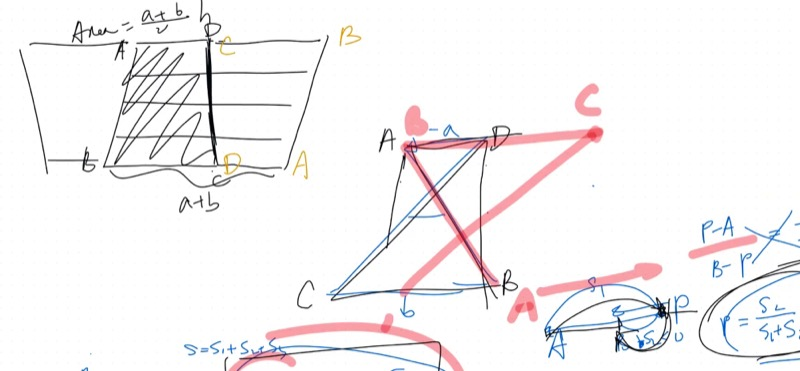
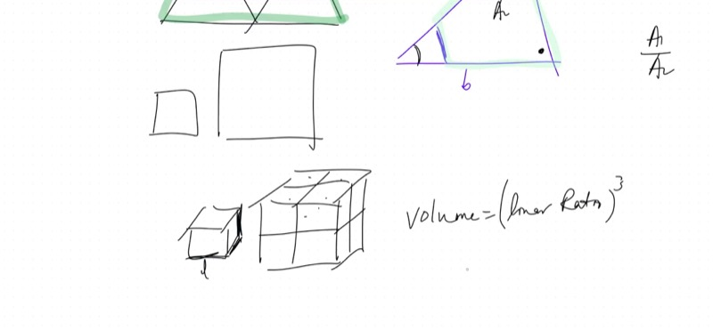
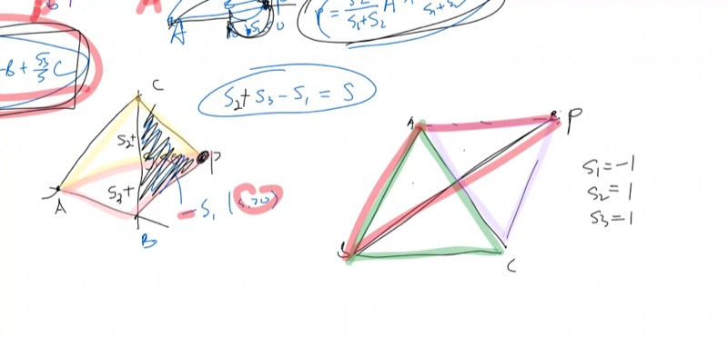
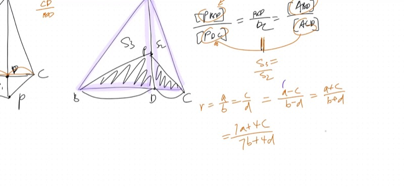

::: {.callout-tip collapse="true"}
## Why Similarity and Scaling Matter

When architects build a scale model of a bridge, they know that doubling every length multiplies the area by 4 and the volume by 8. This **scaling law** shows up everywhere — from computing drug dosages (scaled by body surface area) to understanding why elephants have thicker legs than mice (volume grows faster than cross-section area).
:::

## Topics Covered

- Signed area of "twisted" (crossed) trapezoids
- Proving trapezoid area formula still works with negative bases
- Similar triangles: area ratio = (linear ratio)$^2$
- Volume scaling: volume ratio = (linear ratio)$^3$
- Finding geometric (unsigned) area of a crossed trapezoid
- Rigorous proof: barycentric coordinates for exterior points
- Butterfly triangle method extended to exterior points

## Lecture Video

```{=html}
<video controls width="100%" preload="metadata">
  <source src="https://github.com/ymote/learningmath/releases/download/v1.0/2026-02-25_similar-figures-signed-areas.mp4" type="video/mp4">
</video>
```

## Key Video Frames









## What You Need to Know First

::: {.callout-note collapse="true"}
## What are similar triangles?

Two triangles are **similar** if they have the same angles. This means all corresponding sides are in the same ratio (the **linear ratio**).

If $\triangle ABC \sim \triangle DEF$ with linear ratio $k$, then:
- Every side of $DEF$ is $k$ times the corresponding side of $ABC$
- $\text{Area}(DEF) = k^2 \cdot \text{Area}(ABC)$
:::

::: {.callout-note collapse="true"}
## What is signed area?

**Signed area** assigns a direction to area. A region has **positive** area when traversed counterclockwise and **negative** area when traversed clockwise — or equivalently, when a point is on the "wrong side" of an edge. This lets formulas work universally without case-splitting for inside vs. outside.
:::

## Key Concepts

### Signed Area of a Crossed Trapezoid

When you "twist" a trapezoid (cross the non-parallel sides), the upper base effectively points **backward**. Treating it as $-a$ instead of $a$:

$$\text{Signed area} = \frac{1}{2}(b - a) \cdot h$$

This gives the difference of the two triangular regions, not their sum.

::: {.callout-important}
## Key Idea: Signed vs. Unsigned Area

| Type | Formula | What it gives |
|---|---|---|
| **Signed** area | $\frac{1}{2}(b - a)h$ | $A_2 - A_1$ (difference of triangles) |
| **Unsigned** area | $\frac{1}{2} \cdot \frac{a^2 + b^2}{a + b} \cdot h$ | $A_1 + A_2$ (sum of triangles) |

The signed version is just the standard trapezoid formula with $a$ negative — the formula doesn't change, only the sign of the input!
:::

```{=html}
<div id="calc1" class="desmos-container"></div>
<script src="https://www.desmos.com/api/v1.9/calculator.js?apiKey=dcb31709b452b1cf9dc26972add0fda6"></script>
<script>
  var calc1 = Desmos.GraphingCalculator(document.getElementById('calc1'), {
    expressions: true,
    settingsMenu: false
  });
  calc1.setExpression({ id: 'a', latex: 'a=2', sliderBounds: {min: 0.5, max: 5, step: 0.1} });
  calc1.setExpression({ id: 'b', latex: 'b=6', sliderBounds: {min: 0.5, max: 8, step: 0.1} });
  calc1.setExpression({ id: 'h', latex: 'h=4', sliderBounds: {min: 1, max: 6, step: 0.1} });
  calc1.setExpression({ id: 'A', latex: 'A=(4-a/2, h)', color: '#2d70b3', pointSize: 8, label: 'A', showLabel: true });
  calc1.setExpression({ id: 'D', latex: 'D=(4+a/2, h)', color: '#2d70b3', pointSize: 8, label: 'D', showLabel: true });
  calc1.setExpression({ id: 'B', latex: 'B=(4-b/2, 0)', color: '#c74440', pointSize: 8, label: 'B', showLabel: true });
  calc1.setExpression({ id: 'C', latex: 'C=(4+b/2, 0)', color: '#c74440', pointSize: 8, label: 'C', showLabel: true });
  calc1.setExpression({ id: 'trap', latex: 'polygon(A,B,C,D)', color: '#2d70b3', fillOpacity: 0.15 });
  calc1.setExpression({ id: 'area_label', latex: '(4, h/2)', color: '#388c46', label: 'Area = ½(a+b)·h', showLabel: true, pointSize: 0 });
  calc1.setMathBounds({ left: -2, right: 10, bottom: -2, top: 8 });
</script>
```

### Area and Volume Scaling

For similar figures with linear ratio $k = \frac{a}{b}$:

| Dimension | Scaling |
|---|---|
| Length | $\times\, k$ |
| Area | $\times\, k^2$ |
| Volume | $\times\, k^3$ |

**Example:** Two similar triangles with side ratio $1:2$.

- Area ratio: $1:4$ (not $1:2$!)
- If they were 3D pyramids, volume ratio: $1:8$

::: {.callout-tip collapse="true"}
## Quick mental picture

Think of a square: double each side and you fit **4** copies of the original inside. For a cube: double each edge and you fit **8** copies inside. This works for *any* shape, not just squares and cubes — similarity guarantees it.
:::

```{=html}
<div id="calc2" class="desmos-container"></div>
<script>
  var calc2 = Desmos.GraphingCalculator(document.getElementById('calc2'), {
    expressions: true,
    settingsMenu: false
  });
  calc2.setExpression({ id: 'k', latex: 'k=2', sliderBounds: {min: 0.5, max: 4, step: 0.1} });
  calc2.setExpression({ id: 'small', latex: 'polygon((0,0),(1,0),(0.5,0.87))', color: '#2d70b3', fillOpacity: 0.3 });
  calc2.setExpression({ id: 'big', latex: 'polygon((2,0),(2+k,0),(2+k/2,0.87k))', color: '#c74440', fillOpacity: 0.2 });
  calc2.setExpression({ id: 'label1', latex: '(0.5, -0.5)', color: '#2d70b3', label: 'Area = 1', showLabel: true, pointSize: 0 });
  calc2.setExpression({ id: 'label2', latex: '(2+k/2, -0.5)', color: '#c74440', label: 'Area = k²', showLabel: true, pointSize: 0 });
  calc2.setMathBounds({ left: -1, right: 10, bottom: -2, top: 6 });
</script>
```

### Decomposing a Crossed Trapezoid

Given a crossed trapezoid with upper base $a$ and lower base $b$ ($b > a$), the crossing creates two similar triangles:

- Upper triangle (area $A_1$): has base $a$
- Lower triangle (area $A_2$): has base $b$
- Area ratio: $\frac{A_1}{A_2} = \frac{a^2}{b^2}$

The heights split proportionally: $h_1 = \frac{a}{a+b} \cdot h$, $h_2 = \frac{b}{a+b} \cdot h$

So:
$$A_2 = \frac{1}{2} \cdot b \cdot \frac{b}{a+b} \cdot h = \frac{b^2}{2(a+b)} \cdot h$$

$$A_1 + A_2 = \frac{a^2 + b^2}{2(a+b)} \cdot h$$

### Exterior Barycentric Coordinates: The Proof

To prove $P = \frac{S_1}{S}A + \frac{S_2}{S}B + \frac{S_3}{S}C$ when $P$ is outside $\triangle ABC$:

1. **Extend** $AP$ to meet $BC$ at point $D$
2. **Write** $D$ as a weighted average of $B$ and $C$ using the ratio $\frac{CD}{BD} = \frac{S_2}{S_3}$
   - This uses the butterfly triangle ratio: sub-triangles sharing a cevian maintain the same base ratio
3. **Write** $P$ as a weighted average of $A$ and $D$ using the ratio $\frac{AP}{AD}$
4. **Substitute** the expression for $D$ and simplify

The butterfly triangle property (equal ratios propagate) works identically for exterior points — the proof carries through unchanged.

::: {.callout-important}
## Key Idea: Equal Ratios Propagate

If $\frac{a}{b} = \frac{c}{d}$, then for **any** constants $\alpha, \beta$:

$$\frac{a}{b} = \frac{c}{d} = \frac{a - c}{b - d} = \frac{a + c}{b + d} = \frac{\alpha a + \beta c}{\alpha b + \beta d}$$

Set the common ratio as $r$, write $a = br$ and $c = dr$, then factor out $r$ from any linear combination.

This is why butterfly triangle ratios work: all the sub-triangle pairs are just different linear combinations of the same base ratio.
:::

## Cheat Sheet

::: {.key-formula}
| What you want | What to do |
|---|---|
| Area ratio of similar figures | (Linear ratio)$^2$ |
| Volume ratio of similar figures | (Linear ratio)$^3$ |
| Signed trapezoid area | $\frac{1}{2}(b - a)h$ when upper base is "negative" |
| Unsigned area of crossed trapezoid | $\frac{a^2 + b^2}{2(a+b)} \cdot h$ |
| Exterior barycentric coords | Same formula; $S_i < 0$ when $P$ is on far side of edge $i$ |
| Equal ratio propagation | $\frac{a}{b} = \frac{c}{d} \Rightarrow \frac{\alpha a + \beta c}{\alpha b + \beta d}$ is the same ratio |

### Scaling Laws

$$\text{Length} \times k, \quad \text{Area} \times k^2, \quad \text{Volume} \times k^3$$
:::
