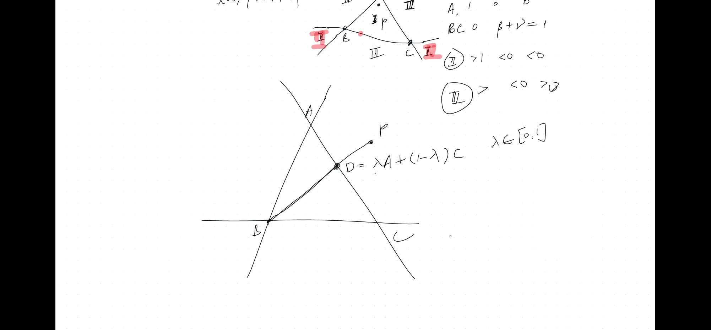
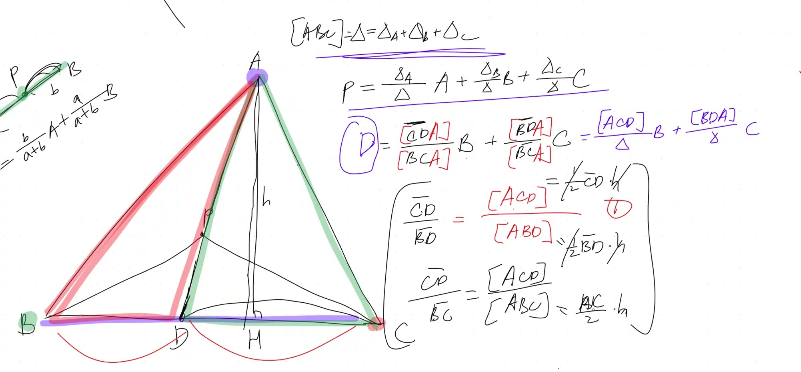
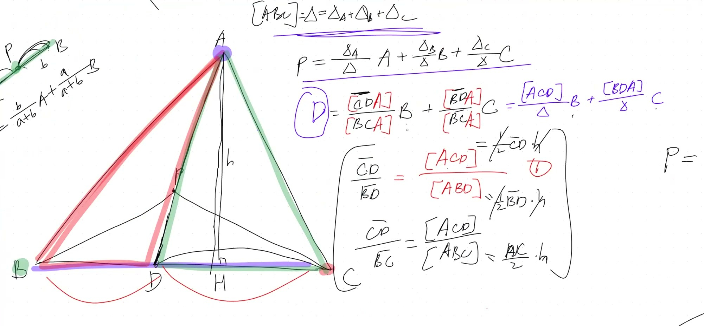
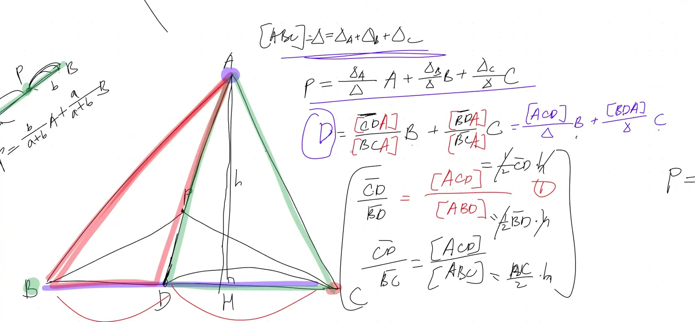

::: {.callout-tip collapse="true"}
## Real-World Connection: Triangles in Computer Graphics

Every 3D model in video games and movies is made of tiny triangles! When a game renders a character's face, it calculates the color of each pixel by taking a weighted average of the colors at the triangle's corners.

This is called **barycentric interpolation** — exactly what we're learning today. Every frame of every 3D game uses this math billions of times per second!
:::

## Topics Covered

- Barycentric coordinates of a triangle
- Area ratios determine linear combination weights
- Interior, exterior, and boundary points
- Three types of regions around a triangle
- Proof: segment ratios = area ratios

::: {.callout-note collapse="true"}
## Review: Points on a line (2 endpoints)

On a line between $A$ and $B$:
$$P = \alpha \cdot A + \beta \cdot B \quad\text{where}\quad \alpha + \beta = 1$$

- Both weights positive → $P$ is between $A$ and $B$
- One weight negative → $P$ is outside the segment
- Weights proportional to opposite distances (closer → more weight)

Now we extend this from 2 points to 3!
:::

## Lecture Video

```{=html}
<video controls width="100%" preload="metadata">
  <source src="https://github.com/ymote/learningmath/releases/download/v1.0/2026-02-16_triangle-area-ratios-linear-combinations.mp4" type="video/mp4">
</video>
```

## Key Video Frames









## Point as Weighted Average of Triangle Vertices

For any point $P$ in the plane with triangle $ABC$:

$$P = \frac{\Delta_A}{\Delta} \cdot A + \frac{\Delta_B}{\Delta} \cdot B + \frac{\Delta_C}{\Delta} \cdot C$$

::: {.callout-tip collapse="true"}
## Why areas?

On a line, the weight was related to **distance** (1D measurement).

In a triangle, the weight is related to **area** (2D measurement).

The proof uses one beautiful fact:

> If two triangles share the same height, their area ratio equals their base ratio.

$$\frac{\text{Area}(\triangle ACD)}{\text{Area}(\triangle ABD)} = \frac{CD}{BD}$$

because Area = $\frac{1}{2} \times \text{base} \times \text{height}$, and the shared height cancels out!
:::

where:

- $\Delta_A$ = area of triangle $BPC$ (opposite vertex $A$)
- $\Delta_B$ = area of triangle $APC$ (opposite vertex $B$)
- $\Delta_C$ = area of triangle $APB$ (opposite vertex $C$)
- $\Delta = \Delta_A + \Delta_B + \Delta_C$ = total area of $ABC$

**Drag point $P$ around the triangle to see the weights change:**

```{=html}
<div id="calc1" class="desmos-container"></div>
<script src="https://www.desmos.com/api/v1.9/calculator.js?apiKey=dcb31709b452b1cf9dc26972add0fda6"></script>
<script>
  var calc1 = Desmos.GraphingCalculator(document.getElementById('calc1'), {
    expressions: true,
    settingsMenu: false
  });
  calc1.setExpression({ id: 'A', latex: '(1, 8)', color: '#c74440', pointSize: 12, label: 'A', showLabel: true });
  calc1.setExpression({ id: 'B', latex: '(7, 2)', color: '#2d70b3', pointSize: 12, label: 'B', showLabel: true });
  calc1.setExpression({ id: 'C', latex: '(10, 9)', color: '#388c46', pointSize: 12, label: 'C', showLabel: true });
  calc1.setExpression({ id: 'AB', latex: '((1-t)\\cdot1+t\\cdot7, (1-t)\\cdot8+t\\cdot2)', parametricDomain: {min: 0, max: 1}, color: '#000000' });
  calc1.setExpression({ id: 'BC', latex: '((1-t)\\cdot7+t\\cdot10, (1-t)\\cdot2+t\\cdot9)', parametricDomain: {min: 0, max: 1}, color: '#000000' });
  calc1.setExpression({ id: 'CA', latex: '((1-t)\\cdot10+t\\cdot1, (1-t)\\cdot9+t\\cdot8)', parametricDomain: {min: 0, max: 1}, color: '#000000' });
  calc1.setExpression({ id: 'G', latex: '(6, 6.33)', color: '#fa7e19', pointSize: 14, label: 'Centroid (equal weights)', showLabel: true });
  calc1.setMathBounds({ left: -1, right: 13, bottom: 0, top: 11 });
</script>
```

## Three Types of Regions

The weights $\alpha, \beta, \gamma$ (with $\alpha + \beta + \gamma = 1$) classify the point:

| Region | Weights | Location |
|---|---|---|
| **Type 1** (interior) | All positive: $\alpha, \beta, \gamma > 0$ | Inside triangle |
| **Type 2** (near vertex) | One $> 1$, other two $< 0$ | Beyond one vertex |
| **Type 3** (near edge) | One $< 0$, other two $> 0$ | Beyond one edge |

## Proof: Segment Ratio = Area Ratio

If $D$ is on segment $BC$, then:

$$\frac{CD}{BD} = \frac{[\triangle ACD]}{[\triangle ABD]}$$

**Why?** Both triangles share the same altitude $h$ from $A$ to line $BC$:

$$\frac{[ACD]}{[ABD]} = \frac{\frac{1}{2} \cdot CD \cdot h}{\frac{1}{2} \cdot BD \cdot h} = \frac{CD}{BD}$$

This is the key insight: **same height → area ratio = base ratio**

## Cheat Sheet

::: {.key-formula}
| Concept | Formula |
|---|---|
| Point in triangle | $P = \alpha A + \beta B + \gamma C$, weights sum to 1 |
| Weight for vertex $A$ | $\alpha = \frac{\text{Area}(\triangle BPC)}{\text{Area}(\triangle ABC)}$ |
| Inside triangle | All three weights positive |
| On an edge | One weight = 0 |
| At a vertex | One weight = 1, others = 0 |
| Centroid | All weights = $\frac{1}{3}$ |
| Area ratio = base ratio | When triangles share same height |
:::
