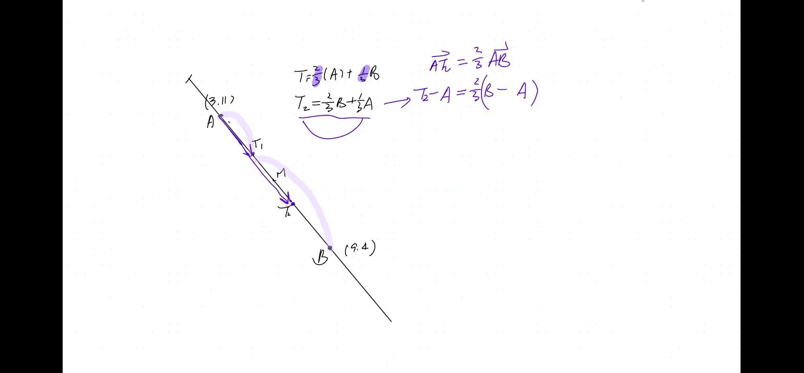
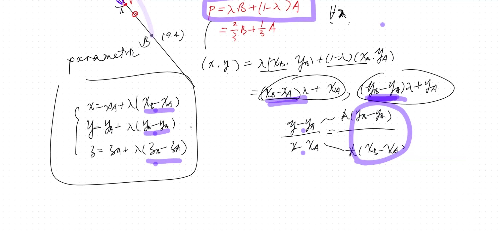
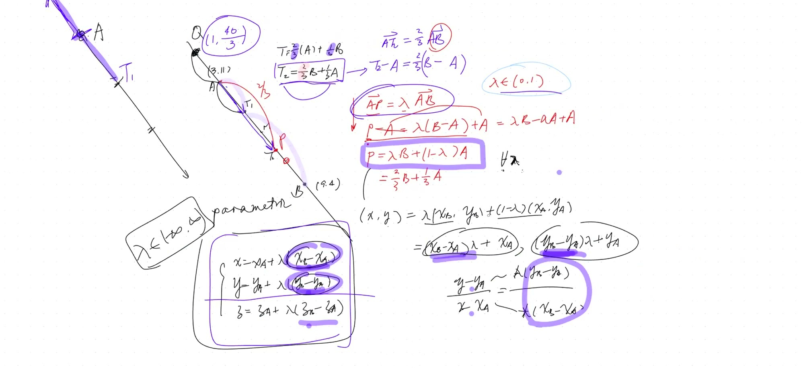
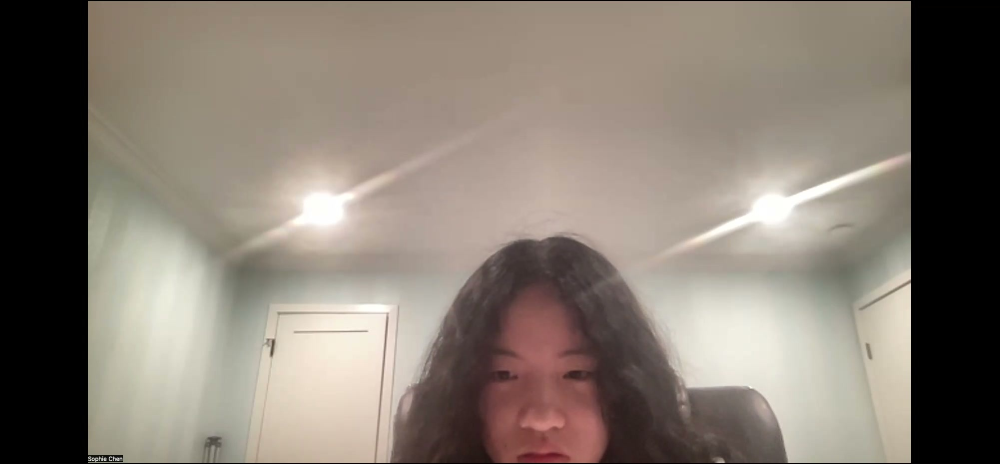

## Topics Covered

- Trisecting points on a line segment
- Weighted averages as linear combinations
- Vector notation: $\vec{AP} = \lambda \cdot \vec{AB}$
- Parametric equations of a line
- Extension to 3D

## Key Video Frames









## Points as Linear Combinations

Given endpoints $A$ and $B$, any point $P$ on line $AB$ can be written:

$$P = \lambda B + (1 - \lambda) A$$

- $\lambda = 0$: at point $A$
- $\lambda = 1$: at point $B$
- $0 < \lambda < 1$: between $A$ and $B$
- $\lambda < 0$ or $\lambda > 1$: **outside** segment $AB$

## Example 1: Find trisecting points

**Given:** $A = (3, 11)$, $B = (9, 4)$

**Trisector $T_1$** (closer to $A$, $\lambda = 1/3$):
$$T_1 = \frac{2}{3}A + \frac{1}{3}B = (5, \tfrac{26}{3})$$

**Trisector $T_2$** (closer to $B$, $\lambda = 2/3$):
$$T_2 = \frac{1}{3}A + \frac{2}{3}B = (7, \tfrac{19}{3})$$

> **Rule:** Closer to a point → give **more** weight to that point

**Drag $\lambda$ to move the point along the line:**

```{=html}
<div id="calc1" class="desmos-container"></div>
<script src="https://www.desmos.com/api/v1.9/calculator.js?apiKey=dcb31709b452b1cf9dc26972add0fda6"></script>
<script>
  var calc1 = Desmos.GraphingCalculator(document.getElementById('calc1'), {
    expressions: true,
    settingsMenu: false
  });
  calc1.setExpression({ id: 'lam', latex: '\\lambda=0.5', sliderBounds: {min: -0.5, max: 1.5, step: 0.01} });
  calc1.setExpression({ id: 'Ax', latex: 'a_x=3' }); calc1.setExpression({ id: 'Ay', latex: 'a_y=11' });
  calc1.setExpression({ id: 'Bx', latex: 'b_x=9' }); calc1.setExpression({ id: 'By', latex: 'b_y=4' });
  calc1.setExpression({ id: 'Px', latex: 'p_x=(1-\\lambda)a_x+\\lambda b_x' });
  calc1.setExpression({ id: 'Py', latex: 'p_y=(1-\\lambda)a_y+\\lambda b_y' });
  calc1.setExpression({ id: 'line', latex: '((1-t)a_x+t\\cdot b_x, (1-t)a_y+t\\cdot b_y)', color: '#bbbbbb', parametricDomain: {min: -0.5, max: 1.5} });
  calc1.setExpression({ id: 'A', latex: '(a_x, a_y)', color: '#c74440', pointSize: 12, label: 'A(3,11)', showLabel: true });
  calc1.setExpression({ id: 'B', latex: '(b_x, b_y)', color: '#2d70b3', pointSize: 12, label: 'B(9,4)', showLabel: true });
  calc1.setExpression({ id: 'P', latex: '(p_x, p_y)', color: '#388c46', pointSize: 14, label: 'P', showLabel: true });
  calc1.setMathBounds({ left: 0, right: 12, bottom: 2, top: 14 });
</script>
```

## Parametric Equations

The parametric form of a line through $A(x_A, y_A)$ and $B(x_B, y_B)$:

$$\begin{cases} x = x_A + \lambda(x_B - x_A) \\ y = y_A + \lambda(y_B - y_A) \end{cases}$$

Eliminating $\lambda$ recovers the familiar slope-intercept form:

$$\frac{y - y_A}{x - x_A} = \frac{y_B - y_A}{x_B - x_A} = m \text{ (slope)}$$

### Extension to 3D

Just add a $z$ equation — **no slope needed!**

$$\begin{cases} x = x_A + \lambda(x_B - x_A) \\ y = y_A + \lambda(y_B - y_A) \\ z = z_A + \lambda(z_B - z_A) \end{cases}$$

## External points

**Given:** $A = (3, 11)$, $B = (9, 4)$, point $Q$ outside $AB$ on side of $A$, with $|AQ| = \frac{1}{3}|AB|$

$$\vec{AQ} = -\frac{1}{3}\vec{AB}$$
(Negative because $Q$ is on the opposite side from $B$)

$$Q = A - \frac{1}{3}(B - A) = (1, \tfrac{40}{3})$$

## Key Formulas

::: {.key-formula}
| Concept | Formula |
|---|---|
| Linear combination | $P = \lambda B + (1-\lambda)A$ |
| Midpoint | $M = \frac{1}{2}(A + B)$ |
| Trisector (near $A$) | $T = \frac{2}{3}A + \frac{1}{3}B$ |
| Vector form | $\vec{AP} = \lambda \cdot \vec{AB}$ |
| Parametric line | $x = x_A + \lambda \Delta x$, etc. |
:::
